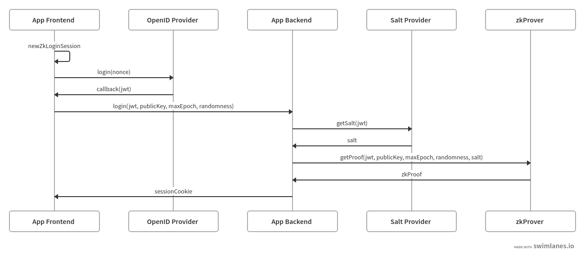
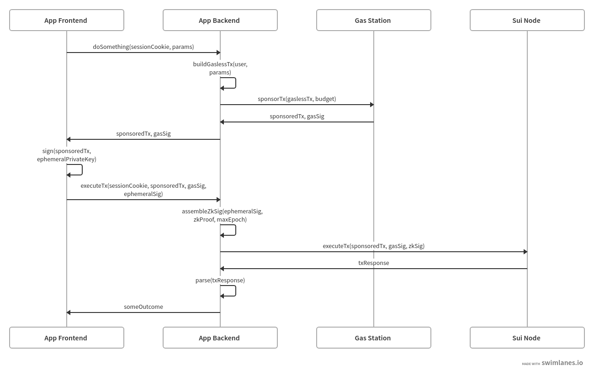

# Next.js zkLogin SDK

Next.js SDK for integrating with [Sui zkLogin](https://docs.sui.io/concepts/cryptography/zklogin).

This SDK aims to provide full-stack support for building user authentication and Sui transaction execution into your Next.js application, using zkLogin primitives.
It aims to deliver a seamless and familiar user experience that blends the Web 2 and Web 3 parts of your application together.

The following areas are covered:

- Client-side React components and hooks for:
  - Initializing local zkLogin session state
  - Integrating with OpenID providers
  - Making auth API calls to the backend
  - Making transaction building and execution API calls to the backend
  - Implementing auth-protected pages with auto-redirection
- Server-side API route handlers for:
  - User session / cookie management
  - Implementing auth API routes
  - Implementing auth-protected API routes
  - Implementing transaction building, sponsorship, and execution API routes
  - NOTE - the server-side SDK only works with Next.js [Pages Router](https://nextjs.org/docs/pages) for now.
    Support for [App Router](https://nextjs.org/docs/app) is planned.

## Getting started

A Next.js [starter template](../../examples/nextjs-zklogin) has been provided to quickly get you off the ground using this SDK.
You can follow the instructions over there to have a working example.
Even if you are starting with an existing Next.js application, it's recommended to check out that example as a reference end-to-end implementation.

## High-level architecture

Here is the intended architecture that can be achieved using this SDK:

Typical flow of signing in with zkLogin:

<!-- Source: https://swimlanes.io/#jZHNDoIwEITvfYo9QoIvwMEE/xKjiSbevNWyYKXsNoC/T28LmiBcvHU7s99M2sRaWFVMDVIKkykkvTkGwvux2HKu6YB1rZlEMvDvLNJ6AfuKbzrFKgbj3QExKQzFQB0HKGnMSaoiuNybUIzofp45ufV2ZGeMwF5PRqsNPiMo5WNpWZ0jqCSlXJIrGoreouccpGl6HXNs/E0X+qONQmunDmmvwts/IHfk7K9WUQsLxXd9lNUKnA3jfl+s7j5izlxoFOIN -->

Typical flow of executing a sponsored transaction block:

<!-- Source: https://swimlanes.io/#fZLBTsMwDIbvfYocU6m8wA5IHQIOSGOiO3HLGtNGbeMoTlDZ02MmChkNO0WW/s/+bKV2Tjx4tAGsFje3ouZ6q9qBy43Q2OAEoTe2kwREBu0d4mCgEk55NVFZJPkVfoxm1I+KRkYPs4wE/l+QY6IJKvCIjSCHltAz0y10xd10B6EskuRq4jcI+gtgtjFdznBZOA8UdeYmCWI6Ky84cD1M4NW49+ZdBXiCjzLf5UcUZmhjAN7wz10zQskArq6fXBHBdBzhdeCoTLlKnIa9R3yrxKTme4dtv2rVRCN2qOHCLyd0Gs4mS36lEeYXOINw1Zb/AoH8DWd3Sy7Pn/E5hpafTw== -->

## Key SDK components

Please refer to inline documentations for more detailed information.

### From `@shinami/nextjs-zklogin/client`

- `withNewZkLoginSession`
  - React HOC for implementing the login page.
  - Resets local session state and prepares a new one.
    The new session state will be needed to get a new JWT from the OpenID providers.
- `getGoogleAuthUrl`, `getFacebookAuthUrl`, `getTwitchAuthUrl`
  - Helper function to compose the auth URLs for each OpenID provider.
  - You'll need to redirect your user to those URLs to complete a sign-in with them.
- `withGoogleCallback`, `withFacebookCallback`, `withTwitchCallback`
  - React HOC for implementing the callback pages for each OpenID provider.
  - After a successful sign-in, the page will automatically issue a login request to your backend (default at `/api/auth/login`), and redirect the user to the original page they were trying to access.
- `useZkLoginSession`
  - React hook to use data from the user's current zkLogin session.
  - The returned data could be one of these types: `ZkLoginSessionLoading`, `ZkLoginSessionActive`, `ZkLoginSessionInactive`.
- `withZkLoginSessionRequired`
  - React HOC for implementing an auth-protected page.
  - User will be redirected to the login page (default at `/auth/login`) if they don't have an active session.
- `apiTxExecMutationFn`
  - Helper function to generate [TanStack mutation](https://tanstack.com/query/latest/docs/react/guides/mutations) functions for end-to-end Sui transaction block execution.
  - Must be used on API routes implemented with `zkLoginSponsoredTxExecHandler` or `zkLoginTxExecHandler` from `@shinami/nextjs-zklogin/server/pages`.

### From `@shinami/nextjs-zklogin/server/pages`

- `authHandler`
  - Implements auth API routes, by default at `/api/auth/login`, `/api/auth/logout`, `/api/auth/me`.
- `withZkLoginUserRequired`
  - Higher-order handler for implementing auth-protected API routes.
  - Requests would result in HTTP 401 if the user doesn't have an active session.
- `withSession`
  - Higher-order handler for augmenting the wrapped handler with session state.
  - The session state is managed using [iron-session](https://github.com/vvo/iron-session), and this is just a thin wrapper on top of `withIronSessionApiRoute`.
- `zkLoginTxExecHandler`
  - Implements API routes for building and executing a Sui transaction block.
  - Two routes are implemented under the hood:
    - `[base_route]/tx` for building the transaction block.
    - `[base_route]/exec` for executing the transaction block after signed by frontend, and parsing the transaction response.
- `zkLoginSponsoredTxExecHandler`
  - Implements API routes for building, sponsoring, and executing a Sui transaction block.
  - Two routes are implemented under the hood:
    - `[base_route]/tx` for building and sponsoring the transaction block.
    - `[base_route]/exec` for executing the transaction block after signed by frontend, and parsing the transaction response.
